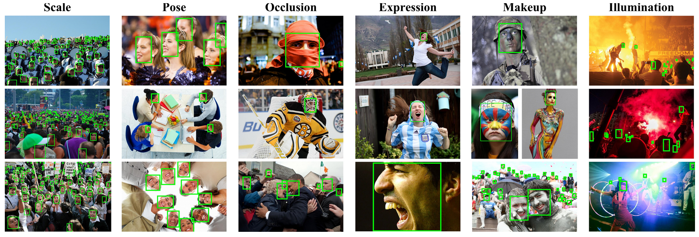
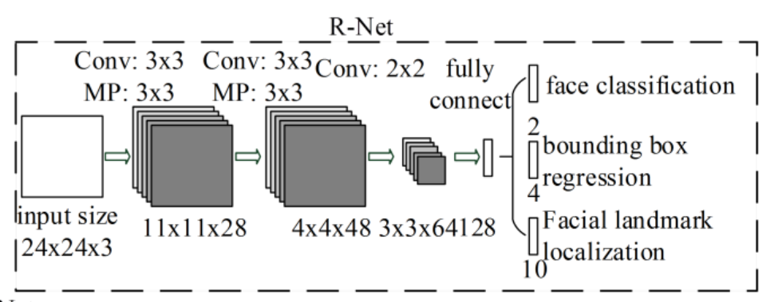
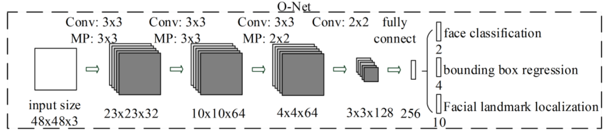

# Machine Learning on Microcontrollers: *Final Project*

## Face detection on ARM Cortex-M7 Microcontroller
This project faces the challenge of deploying a face detection model to a microcontroller. The approach used takes inspiration from the famous **MTCNN** framework, highlighting its limitis for the deployment on highly resource constrained platforms. An alternative approach is proposed, that can run on such architecture with a good balance between accuracy and resource utilization. 

### Dataset generation
The dataset used to train the networks is generated from the popular **WIDERface** dataset, in a similar way as that described for the training of MTCNN networks. For every image of the dataset, a fixed number of *positive*, *negative* and *partial* samples are generated. This allows to collect a high number of training and validation samples, which for the results reported consists in 193k images and 74k valildation images.

### Network architecture
The project compares two different CNN (Convolutional Neural Network) architectures, called *rnet* and *onet*, as thir structure is inspired from networks in the MTCNN framework. The *onet* is a CNN which takes 48x48x3 input images and produces a binary classification score and 4 bounding box regresssion offsets. Its implementation requires almost 500KB on the target microcontroller, resulting in a borderline saturation in terms of area usage. The *rnet* is instead a smaller network that optimizes memory usage and especially latency, with a peak inference throughput of 3 frames/s.

### Microcontroller
A STM32 Nucleo-144 board was used for the project, featuring a Cortex-M7 microcontroller with a 2MB flash and a 512KB RAM memories. The board was programmed through the STMCube IDE, which supports programming and configuration of many development boards from STM. The deployment of the networks is done through the support of Tensorflow Lite Micro, which provides a backend for the implementation of the most common neural network layers, optimized for different ARM architectures, through the usage of the CMSIS-NN library. An example of a possible program that runs the networks developed is provided in the cube_ide directory. A fixed size image (either 48x48x3 or 24x24x3) is loaded to the main memory of the microcontroller with serial communication through the USB-UART port of the board. Inference is then run for the image, and the output is transmitted back to the host, including the classification score and the bounding box regression values.
